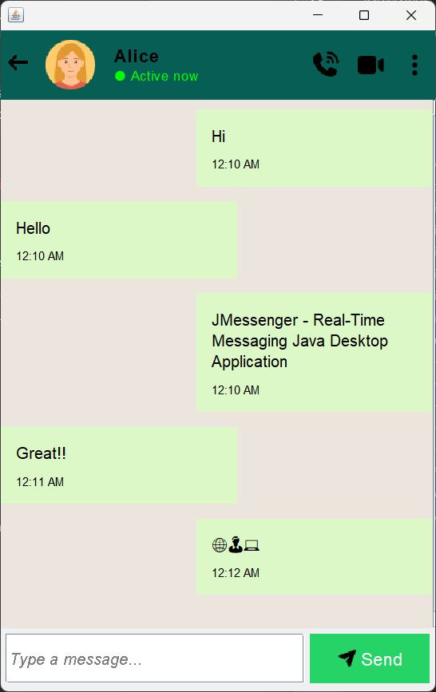
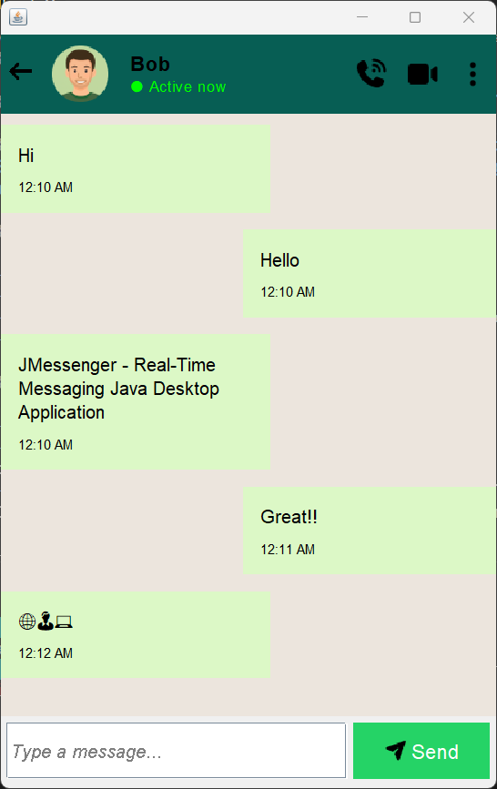

# JMessenger

## JMessenger - Real-Time Messaging Java Desktop Application

### A simple real-time chatting application built using Java, Swing UI, and Socket Programming. It supports sending & receiving messages between Server and Client.

## Features

- Modern Chat UI using Java Swing
- Real-time messaging with TCP Sockets
- Multiple message send options: Button click or Enter key
- Auto-scroll to always show the latest message

## Technologies Used

- Java, OOPs (Object-Oriented Programming System)
- UI Framework: Swing + AWT (Abstract Window Toolkit) for building a modern GUI (Graphical User Interface)
- Network Communication: TCP/IP Socket Programming (Transmission Control Protocol / Internet Protocol) for real-time messaging

## Preview

<div align="center" width="100%">
    <table width="100%">
        <tr width="100%">
            <td align="center" width="45%">
                <b>Server UI</b><br>
                
            </td>
            <td align="center" width="45%">
                <b>Client UI</b><br>
                
            </td>
        </tr>
    </table>
</div>

## Installation & Run

### 1. Clone the Repository

```bash
git clone https://github.com/OmkarArdekar12/JMessenger.git
cd JMessenger
```

### 2. Run Locally

You can run the project using any one of the following methods:

#### 2.1. Method 1 - Run Server & Client Separately

Open Terminal 1:

```bash
cd src
javac javac chatting/application/*.java
java chatting.application.Server
```

Open Terminal 2:

```bash
cd src
java chatting.application.Client
```

#### 2.1. Method 2 - Run Both Using MessengerApp

```bash
cd src
javac chatting/application/*.java
java chatting.application.MessengerApp
```

OR

```bash
cd src
javac chatting/application/*.java && java chatting.application.MessengerApp
```

<br/>
<br/>
<hr/>
